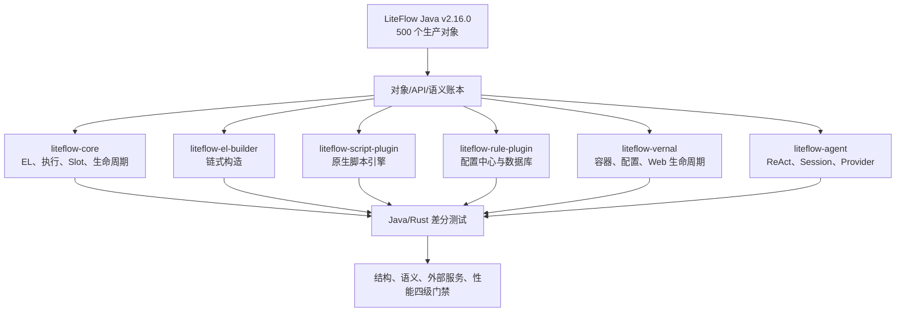

# liteflow-rust v2.16.0 全量语义迁移路线图规范

日期：2026-07-29
状态：活跃
落点：liteflow-rust 全 workspace（liteflow-core / liteflow-derive / liteflow-el-builder / liteflow-rule-plugin / liteflow-script-plugin / liteflow-vernal / liteflow-agent / liteflow-benchmark / liteflow-testcase-el）

---

## 1. 目标与完成定义

目标不是"Rust 能运行类似流程"，而是以 LiteFlow Java v2.16.0 为唯一事实源，
完成对象、公开 API、执行结果、错误、生命周期、并发、热更新和外部集成语义迁移。
Rust 可以采用所有权、异步任务、trait、serde、Vernal 等惯用形态，但每个差异必须
能够追溯到 Java 对象和方法，并由测试证明等价或由边界文档明确说明不等价。

"全量完成"必须同时满足：

1. Java 生产对象逐个进入《对象级对照表》，不存在未裁决对象。
2. Java 公共方法逐个建立 Rust API 或显式语义映射，不以空 setter、alias 或 stub
   消除缺口。
3. 核心 EL、组件、Slot、重试/回滚、并行、生命周期、脚本、规则源和 Agent 行为
   通过 Java/Rust 差分用例。
4. 外部服务能力在真实协议、鉴权、故障恢复和长稳场景中验证；本地 fixture 或
   单节点容器不能标成生产完成。
5. 满足本仓库 Rust 命名、单对象单文件、中文注释、无 wildcard 生产 import、
   无 `compat.rs`、无 `todo!`/`unimplemented!` 的红线。

## 2. 当前可复验基线

### 2.1 规模

| 项目 | 当前值 | 说明 |
|---|---:|---|
| Java `src/main/java` 对象 | 500 | 排除 `package-info.java` |
| Java `src/test/java` 文件 | 3,739 | 后续差分用例池，不等于已迁移测试数 |
| Rust workspace package | 72 | `cargo metadata --no-deps` |
| Rust `Cargo.toml` | 73 | 含 workspace/聚合清单 |
| Rust 生产 `src/**/*.rs` | 892 | 包含 Rust 新增基础设施对象 |
| Rust 外置 `tests/**/*.rs` | 106 | 不含源码内 `#[cfg(test)]` |

Java 生产对象按模块分布：

| Java 模块 | 对象数 | Rust 目标 |
|---|---:|---|
| `liteflow-core` | 304 | `liteflow-core`、`liteflow-derive`，少量宿主适配 |
| `liteflow-el-builder` | 18 | `liteflow-el-builder` |
| `liteflow-rule-plugin` | 61 | `liteflow-rule-plugin/*` |
| `liteflow-script-plugin` | 23 | `liteflow-script-plugin/*` |
| `liteflow-spring` | 22 | `liteflow-vernal`、`liteflow-derive` |
| `liteflow-spring-boot-starter` | 5 | `liteflow-vernal/src/springboot` |
| `liteflow-spring-boot4-starter` | 5 | `liteflow-vernal/src/springboot4` |
| `liteflow-solon-plugin` | 15 | `liteflow-vernal/src/solon` |
| `liteflow-react-agent` | 47 | `liteflow-agent/*` |
| **合计** | **500** | benchmark/testcase 不含生产 Java 对象 |

### 2.2 当前结构结论

- `liteflow-core` 304/304、`liteflow-el-builder` 18/18 可按对象 basename 唯一命中。
- 全工作区 472/500 个 Java 对象存在直接 basename 对应；28 个不是直接同名：
  15 个 Janino/JSR223 JVM 专属对象、8 个 Spring→Vernal 重命名对象、2 个规则
  插件缩写/拼写映射、3 个 ReAct 文件名映射。
- Spring Boot 3、Boot 4、Solon 存在合法同名简单类，必须依靠包路径区分，不能只
  用 basename 判重。
- 当前没有 `compat.rs`、`lib.rs/mod.rs` 公共类型定义、生产
  `todo!`/`unimplemented!`；扫描出的 `use super::*` 均位于源码内测试模块，
  生产实现仍需在 CI 中按 AST/`#[cfg(test)]` 边界校验。
- 两侧当前都没有 `.codegraph/`，因此旧文档记录的 CodeGraph 方法审计只能作为
  历史快照，不能作为 2026-07-29 的可复验证据。
- 2026-07-29 首次全特性检查发现 `reqwest 0.13.4` 的旧 `rustls-tls` feature，
  已改为 `rustls`。随后发现清单中的 `rusqlite 0.40.1` 与现有锁文件
  `0.32.1` 不一致，并和 AgentScope `sqlx 0.8.x` 的 SQLite native links 冲突；
  当前先锁定已验证的 `rusqlite = 0.32.1`，最终仍按 M4 迁移到统一 sqlx/rbdc。

### 2.3 2026-07-29 全工作区覆盖率基线

首次基线（未排除生产文件、未关闭 feature）：

| 指标 | 已覆盖 | 总量 | 覆盖率 |
|---|---:|---:|---:|
| Region | 44,731 | 57,085 | 78.36% |
| Function | 5,247 | 6,789 | 77.29% |
| Line | 32,287 | 40,997 | 78.75% |

因此当前 **不满足 100% 覆盖率验收**，缺口为 8,710 行、1,542 个函数和
12,354 个 region。

2026-08-04 core 包最新覆盖率：

| 指标 | 已覆盖 | 总量 | 覆盖率 |
|---|---:|---:|---:|
| Region | 23,703 | 25,326 | 93.59% |
| Function | 3,347 | 3,558 | 94.07% |
| Line | 17,588 | 18,712 | 93.99% |

## 3. 目标架构

边界原则：

- `liteflow-core` 不依赖 Web 容器、数据库或具体脚本引擎。
- LiteFlow Chain EL 的 `THEN/WHEN/IF/...` 继续由 QLExpress4 Rust 实现承载；
  `vernal-expression` 的 SpEL 只用于宿主配置/条件表达式，不替换 Chain EL。
- Spring Boot/Solon 语义由 `liteflow-vernal` 的配置、生命周期、注册表和
  Axum/Actix 适配实现；不模拟 JVM classpath。
- 外部规则源和脚本引擎各自独立 crate，core 只保留稳定契约。
- Agent provider 通过 `Model`/Provider 契约接入，不把 OAuth、重试、限流和网络
  细节堆入 `liteflow-agent-core`。

## 4. 复用优先的组件决策

| 能力 | 决策 | 用途与边界 |
|---|---|---|
| `qlexpress 0.1.0-alpha.1` | 采用，P0 固化 | Chain EL 与 QLExpress 脚本使用真实 lexer/parser/compiler/QVM |
| `groovy 0.1.0`（lib `groovyrs`） | P0 适配 POC | 真实 lexer/parser/compiler + fusevm/Cranelift JIT，无 JVM |
| `mlua 0.12` | 采用 | Lua 执行、绑定、缓存和中断 |
| `pyo3 0.29` | 采用 | CPython 嵌入 |
| `boa_engine 0.21` | 采用 | JavaScript 原生执行 |
| `antlr-rust-runtime` | 暂不采用 | 仅在 Java 语法文件必须原样生成时引入 |
| `validator` + derive | P1 按边界采用 | 配置/VO 的字段与结构校验 |
| `aspect-core 0.1.2` | 不替换核心 AOP | 通用 JoinPoint/Advice 可用于 Vernal 横切扩展 |
| `serde`/`serde_json` | 已采用 | Jackson 映射 |
| `quick-xml 0.41` | 已采用 | XML 规则解析/序列化 |
| `reqwest` | 采用 | Apollo 等 HTTP 规则源统一异步客户端 |
| `tokio-util::CancellationToken` | 采用 | 规则 watcher、轮询、监控任务的统一停止 |
| `inventory` | 分阶段采用 | ScriptExecutor、ModelProvider 等 SPI 自动注册 |
| `tracing` + `metrics` | 采用 | 统一日志、耗时、错误、重载和队列指标 |
| `sqlx` 或 `rbdc` | P1 选型 | SQL 规则插件从 SQLite 单实现抽象为多数据库 |
| `moka` | 有条件采用 | 仅用于可再生、有容量边界的缓存 |
| Vernal `ConfigurationProperties` | 采用到集成层 | 绑定 LiteFlow 配置 |

## 5. 分阶段路线

### M0：基线与文档账本（已完成）

交付：四份权威文档（路线图、对象级对照、语义对照、名称一致性检查）。
统一 Java v2.16.0 为唯一基线。

### M1：对象与名称闭环（已完成）

500/500 对象均有唯一裁决；名称差异为 0 或全部为经批准的显式例外。

### M2：核心公开 API 与执行语义差分（进行中）

范围：EL operator、builder、parser、Chain/Node/Condition、Slot/DataBus/CmpContext、
重试/超时/并行/回滚/取消、FlowEvent、生命周期、AOP、Monitor、规则替换。

退出条件：核心 304 对象公共 API 全裁决，关键行为差分全绿，无静默降级。

### M3：脚本集成闭环（进行中）

QLExpress/Lua/Python/JavaScript/Groovy/Kotlin/Aviator 统一生命周期。

退出条件：每种引擎都有普通/Boolean/Switch/For、上下文写回、异常、缓存、
卸载/重载和并发隔离测试。

### M4：规则插件与托管任务（进行中）

六类规则源的 watcher/polling、TLS/ACL、集群故障、长稳验证。

退出条件：六类规则源均有无连接契约测试、真实服务测试、故障测试和可重复清理。

### M5：Vernal 宿主集成（进行中）

ConfigurationProperties 统一、Axum/Actix 适配、path dependency 消除。

退出条件：22+5+5+15 个 Java 宿主对象逐个裁决，启动/关闭/刷新/多上下文测试全绿。

### M6：Agent 与 Provider（进行中）

Java 47 个 Agent 对象差分闭环；provider 真实网络契约验证。

退出条件：Java 对象差分闭环；provider 真实网络契约、错误映射、重试、凭证刷新、
取消和速率限制均有可控测试。

### M7：测试语料与性能（未开始）

Java 3,739 个测试迁移账本；benchmark 对齐。

退出条件：测试对照无未裁决项，性能回归阈值可执行。

### M8：生产认证（未开始）

多节点、跨网络、TLS/ACL、滚动升级、故障注入和长稳。

## 6. 优先级看板

| 优先级 | 当前任务 | 完成证据 |
|---|---|---|
| 已完成 | `reqwest 0.13.4` 的 `rustls`/`form` feature 修复 | workspace 全特性依赖解析与构建通过 |
| 已完成 | 锁定 `rusqlite 0.32.1` 与 AgentScope sqlx 的 SQLite ABI | SQL 插件 7 项集成测试通过 |
| P0 | `groovy 0.1.0` LiteFlow 适配 POC | bindings/ScriptBean/五类节点/写回/remove/reload/取消均通过差分测试 |
| P0 | 13 个非 JVM 名称差异收口 | 名称审计 0 未裁决 |
| P0 | 15 个 Janino/JSR223 对象逐项裁决 | 对象表 + 差分/边界测试 |
| P0 | Kotlin remove/reload、脚本统一生命周期 | 测试覆盖 |
| P0 | watcher/monitor 取消与优雅关闭 | 无遗留任务、连接、容器 |
| P0 | 核心方法级 CodeGraph 审计恢复 | 双索引 + 可重复报告 |
| P0 | 声明式组件 Java testcase 差分验收 | 逐项运行 Java declare testcase |
| 已完成 | Vernal ParseOne 物化、LRU 与组件输入并行稳定性 | 128 轮并发交错；连续 20 次 36/36 |
| P0 | 剩余进程级 SPI Holder 作用域裁决 | 逐项证明作用域 |
| P0 | 覆盖率缺口闭环 | 全 workspace 100% |
| P1 | Apollo 异步客户端与真实集群 | 协议/鉴权/灰度/故障测试 |
| P1 | SQL 三数据库 | SQLite/MySQL/PostgreSQL 同契约 |
| P1 | Vernal 配置与发布依赖收口 | 无跨仓库 path 发布阻塞 |
| P1 | Agent provider 真实网络与凭证生命周期 | 合同测试 + 可控故障 |
| P1 | Java 3,739 测试迁移账本 | 每项已迁移/替代/不适用 |
| P2 | 性能、长稳、安全与发布认证 | CI 报告和发布清单 |

## 7. 每项迁移的强制流程

禁止以文件数量、编译通过或单元测试数量单独宣称迁移完成。

## 8. 风险与控制

| 风险 | 控制 |
|---|---|
| 把 Rust 惯用改写误报为 Java 等价 | 对象表保留 FQN，语义表记录差异，差分测试裁决 |
| JVM 语言名称相同但能力不足 | 明确受控子集，负向测试 |
| 外部服务本地单节点被误报为生产 | 证据分级：fixture、单节点、集群故障、长稳 |
| 热更新半成功污染运行态 | 解析/校验后原子发布，失败保留旧快照 |
| 后台任务泄漏 | CancellationToken + JoinHandle + 关闭测试 |
| path dependency 无法发布 | 发布门禁拒绝工作区外 path |

## 9. 工程红线

| 红线 | 说明 |
|---|---|
| snake_case 路径 | `src/` 以下目录、文件名一律 snake_case |
| 一文件一对象 | 每个 `.rs` 文件只对应一个 Java 对象 |
| 中文注释 | 对象/方法/代码段注释从 Java 复制并中文化 |
| 无 `compat.rs` | 禁止 compat.rs 转发式引用 |
| 无生产 `todo!`/`unimplemented!` | 生产代码不得有占位宏 |
| 无生产 wildcard import | 生产实现不得使用 `use super::*` |
| 无 `lib.rs`/`mod.rs` 公共类型 | 仅做模块声明与 re-export |
