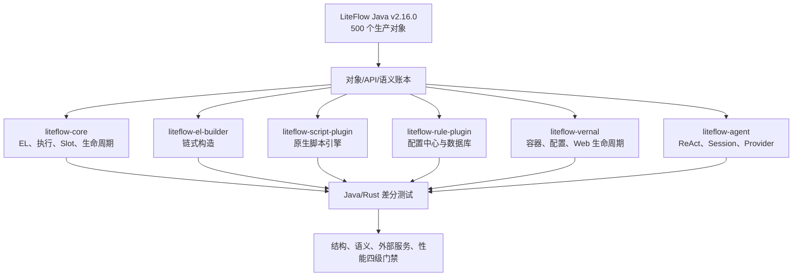

# liteflow-rust v2.16.0 全量语义迁移路线图

> 更新日期：2026-07-29
> Java 唯一基线：`/Users/wandl/workspaces/workspace-github/liteflow`，版本
> `2.16.0`。Rust 目标：
> `/Users/wandl/workspaces/workspace-github-easy-4-rust/liteflow-rust`。

## 1. 目标与完成定义

目标不是“Rust 能运行类似流程”，而是以 LiteFlow Java v2.16.0 为唯一事实源，
完成对象、公开 API、执行结果、错误、生命周期、并发、热更新和外部集成语义迁移。
Rust 可以采用所有权、异步任务、trait、serde、Vernal 等惯用形态，但每个差异必须
能够追溯到 Java 对象和方法，并由测试证明等价或由边界文档明确说明不等价。

“全量完成”必须同时满足：

1. Java 生产对象逐个进入《对象级对照表》，不存在未裁决对象。
2. Java 公共方法逐个建立 Rust API 或显式语义映射，不以空 setter、alias 或 stub
   消除缺口。
3. 核心 EL、组件、Slot、重试/回滚、并行、生命周期、脚本、规则源和 Agent 行为
   通过 Java/Rust 差分用例。
4. 外部服务能力在真实协议、鉴权、故障恢复和长稳场景中验证；本地 fixture 或
   单节点容器不能标成生产完成。
5. 满足本仓库 Rust 命名、单对象单文件、中文注释、无 wildcard 生产 import、
   无 `compat.rs`、无 `todo!`/`unimplemented!` 的红线。

## 2. 当前可复验基线

### 2.1 规模

| 项目 | 当前值 | 说明 |
|---|---:|---|
| Java `src/main/java` 对象 | 500 | 排除 `package-info.java` |
| Java `src/test/java` 文件 | 3,739 | 后续差分用例池，不等于已迁移测试数 |
| Rust workspace package | 72 | `cargo metadata --no-deps` |
| Rust `Cargo.toml` | 73 | 含 workspace/聚合清单 |
| Rust 生产 `src/**/*.rs` | 892 | 包含 Rust 新增基础设施对象 |
| Rust 外置 `tests/**/*.rs` | 106 | 不含源码内 `#[cfg(test)]` |

Java 生产对象按模块分布：

| Java 模块 | 对象数 | Rust 目标 |
|---|---:|---|
| `liteflow-core` | 304 | `liteflow-core`、`liteflow-derive`，少量宿主适配 |
| `liteflow-el-builder` | 18 | `liteflow-el-builder` |
| `liteflow-rule-plugin` | 61 | `liteflow-rule-plugin/*` |
| `liteflow-script-plugin` | 23 | `liteflow-script-plugin/*` |
| `liteflow-spring` | 22 | `liteflow-vernal`、`liteflow-derive` |
| `liteflow-spring-boot-starter` | 5 | `liteflow-vernal/src/springboot` |
| `liteflow-spring-boot4-starter` | 5 | `liteflow-vernal/src/springboot4` |
| `liteflow-solon-plugin` | 15 | `liteflow-vernal/src/solon` |
| `liteflow-react-agent` | 47 | `liteflow-agent/*` |
| **合计** | **500** | benchmark/testcase 不含生产 Java 对象 |

### 2.2 当前结构结论

- `liteflow-core` 304/304、`liteflow-el-builder` 18/18 可按对象 basename 唯一命中。
- 全工作区 472/500 个 Java 对象存在直接 basename 对应；28 个不是直接同名：
  15 个 Janino/JSR223 JVM 专属对象、8 个 Spring→Vernal 重命名对象、2 个规则
  插件缩写/拼写映射、3 个 ReAct 文件名映射。
- Spring Boot 3、Boot 4、Solon 存在合法同名简单类，必须依靠包路径区分，不能只
  用 basename 判重。
- 当前没有 `compat.rs`、`lib.rs/mod.rs` 公共类型定义、生产
  `todo!`/`unimplemented!`；扫描出的 `use super::*` 均位于源码内测试模块，
  生产实现仍需在 CI 中按 AST/`#[cfg(test)]` 边界校验。
- 两侧当前都没有 `.codegraph/`，因此旧文档记录的 CodeGraph 方法审计只能作为
  历史快照，不能作为 2026-07-29 的可复验证据。索引由维护者重建后再恢复方法级
  自动审计。
- 2026-07-29 首次全特性检查发现 `reqwest 0.13.4` 的旧 `rustls-tls` feature，
  已改为 `rustls`。随后发现清单中的 `rusqlite 0.40.1` 与现有锁文件
  `0.32.1` 不一致，并和 AgentScope `sqlx 0.8.x` 的 SQLite native links 冲突；
  当前先锁定已验证的 `rusqlite = 0.32.1`，最终仍按 M4 迁移到统一 sqlx/rbdc。
- 锁文件刷新还暴露了 syn 3、PyO3 0.29、etcd-client 0.19、redis 1.4、
  chacha20poly1305 0.11、hmac 0.13 的 API 漂移，均已迁移到公开新 API；
  `cargo check --workspace --all-features` 已于 2026-07-29 通过。

### 2.3 2026-07-29 全工作区覆盖率基线

执行命令：

```bash
DYLD_LIBRARY_PATH=/Library/Frameworks/Python.framework/Versions/3.13/lib \
cargo llvm-cov --workspace --all-features --no-fail-fast --summary-only
```

首次基线没有排除生产文件、没有关闭 feature，也没有把失败测试忽略，并暴露了
3 个失败目标。完成下述首轮修复后，以同一命令重新执行全
workspace/all-features，该次测试通过并生成以下完整报告快照：

| 指标 | 已覆盖 | 总量 | 覆盖率 |
|---|---:|---:|---:|
| Region | 44,731 | 57,085 | 78.36% |
| Function | 5,247 | 6,789 | 77.29% |
| Line | 32,287 | 40,997 | 78.75% |

因此当前 **不满足 100% 覆盖率验收**，缺口为 8,710 行、1,542 个函数和
12,354 个 region。该差距必须通过真实测试补齐，禁止使用 `#[coverage(off)]`、
忽略生产文件、删除分支或关闭 feature 提升数字。

本轮已完成两个确定失败的语义修复：

1. `@LiteflowCmpDefine`：Rust 宏新增类级 `node_type`/`node_name`，节点类型进入
   `DeclWarpBean`、`MethodWrapBean` 和运行时 Operator 校验；Common 与 Boolean
   必须使用不同 nodeId，定向测试 7/7 通过。
2. EL Builder：QLExpress 关键字及非标识符节点 ID 自动渲染为 `node("id")`；
   `continue` 不再被解析为控制语句，定向测试 10/10 通过。
3. 声明式组件：`@LiteflowMethod` 的 `value/nodeId/nodeName/nodeType` 已按 Java
   规则生成多 `DeclWarpBean`，EL 可直接引用 nodeId；访问、结束、错误继续、
   前后置、成功、错误（含真实错误参数）、回滚和方法级重试已进入真实节点执行
   路径；动态显示名进入真实步骤，自定义 NodeExecutor 类名进入注册表解析。
   derive 运行测试 13/13（含 AND/OR 执行前的异步 `isAccess` 过滤）、核心动态
   控制测试 5/5、workspace 全特性编译通过。
   尚缺 Java testcase 自动差分账本，不能把整个声明式模块标记为完成。

另一个失败为 Vernal `PARSE_ONE_ON_FIRST_EXEC` LRU 与组件输入用例的并行隔离
问题，包含三个独立语义点：

1. `LiteflowRuntime` 原先每次执行都临时构造 `FlowExecutor`，会重新读取进程级
   `LiteflowConfigGetter` 并初始化 DataBus；现改为持有冻结配置的
   `FlowExecutor::new_isolated` 单例，Java `new_with_config` 的全局发布语义保持
   不变。
2. `RuleDefinitionPlan` 已进入最终物化阶段后，原先仍通过
   `LiteFlowChainELBuilder::build` 二次读取全局 `parse_mode`。并行上下文把它切为
   `ParseOne` 时，目标链会被重新注册成“未编译空占位链”。现新增
   `build_immediately`，物化阶段无条件编译，保持 Java
   `buildUnCompileChain` 的两阶段边界。
3. 进程级 `CmpAroundAspectHolder` 会把某个 ApplicationContext 的业务切面泄漏
   给其他上下文；Vernal/Solon 业务切面现限定到各自 `FlowBus`，全局 Holder 只
   保留无业务状态的 SPI 形态。

新增的并发回归在单个测试内执行 128 轮“组件数据传递 + ParseOne/LRU 淘汰”
交错；完整 Vernal 默认并行测试二进制连续 20 次均为 36/36，core 物化回归
12/12，全特性覆盖率构建中的 Vernal 集成测试为 37/37。该已知串扰路径已经闭环，
但其余进程级 SPI Holder 仍须逐个完成作用域裁决，不能据此宣称所有宿主全局状态
均已隔离。

本轮另执行 core + Vernal 全特性覆盖率增量审计（不是 workspace 总覆盖率）：

| 指标 | 已覆盖 | 总量 | 覆盖率 |
|---|---:|---:|---:|
| Region | 23,377 | 30,574 | 76.46% |
| Function | 3,344 | 4,205 | 79.52% |
| Line | 17,711 | 22,592 | 78.40% |

该增量审计同样未使用覆盖率排除；它用于定位下一批测试缺口，不能替代上方的全
workspace 验收口径。

完成声明式组件切片后，又执行 core + derive 全特性覆盖率增量审计；全部运行测试
和 7 个 trybuild 编译契约通过，但覆盖率仍明显不足：

| 指标 | 已覆盖 | 总量 | 覆盖率 |
|---|---:|---:|---:|
| Region | 20,691 | 28,304 | 73.10% |
| Function | 2,956 | 3,758 | 78.66% |
| Line | 15,430 | 20,525 | 75.18% |

其中 `lite_flow_chain_el_builder.rs` 行覆盖率仅 34.59%，
`liteflow_cmp_define.rs` 为 62.09%；这两个文件是下一轮测试补齐的首要目标。

2026-07-29 又按 Java `LiteFlowChainELBuilder` 源码逐行复核 route 与实例编号
状态机，修复三项可观察差异：

1. Java 在全部操作符执行后按最终对象类型校验 route；`retry/maxWait/ignoreError`
   会产生包装 Condition，不能因为内部是 Boolean Node 就放行。Rust 现拒绝
   `El::Mods` route，同时保留直接写入 Node 的 `tag/data/bind` route。
2. Java `compileChain` 即使没有 route EL 也会执行
   `chain.setRouteItem(this.route)`；从已有 Chain 重编译时，旧 routeItem 现会被
   明确清除。
3. 主体 Condition 构建失败时，Rust 现清除本轮实例编号恢复表、待写 DTO 与开关，
   不再让同一 Builder 的后续类型化构建继承半成品状态。
4. Java `validateWithEx` 会真实执行 EL Operator，而不是只检查语法和 ID 是否注册；
   Rust 现同样构建临时可执行树，Common Node 放入 IF/AND 等布尔位置会校验失败。

新增真实回归覆盖包装 route 拒绝、带 tag Boolean Node route、旧 route 清理及
失败主体实例编号隔离，并补充注册节点类型错误的 validate 回归；
`cargo test -p liteflow-core --all-features` 全部通过。
随后执行未排除生产文件的 core 全特性覆盖率：

```bash
cargo llvm-cov -p liteflow-core --all-features --summary-only
```

| 指标 | 已覆盖 | 总量 | 覆盖率 |
|---|---:|---:|---:|
| Region | 19,781 | 28,852 | 68.56% |
| Function | 2,899 | 3,872 | 74.87% |
| Line | 14,850 | 20,795 | 71.41% |

该数字是本轮新生成的 **core 包基线**，不是 workspace 验收结果；仍缺 5,945
行。由于泛型/异步代码在当前覆盖构建中的实例化口径变化，
`lite_flow_chain_el_builder.rs` 当前报告为 27.72%（673/2,428 行），不能与
先前 core+derive 的 34.59% 直接作趋势比较。100% 目标尚未达到。

继续复核 Java Operator 后又修复两项原语义：

1. `IgnoreErrorOperator` 只接受 `WhenCondition`。删除此前误造的普通
   `IgnoreErrorCondition` 和 `Mods.ignore_error`；普通 Condition 调用现在按
   Java 转型约束失败。
2. `retry` 与 `maxWait` 每次调用都创建新包装 Condition，Rust AST 不再合并并
   固定重排。解析测试覆盖 `maxWait.retry`、`retry.maxWait`、重复 retry；真实
   Tokio 执行证明两种次序分别产生“两次执行后成功”和“一次执行后外层超时”。

core 全特性测试再次全部通过。最新覆盖率快照为：

| 指标 | 已覆盖 | 总量 | 覆盖率 |
|---|---:|---:|---:|
| Region | 19,816 | 29,578 | 67.00% |
| Function | 2,902 | 3,944 | 73.58% |
| Line | 14,871 | 21,288 | 69.86% |

当前仍缺 6,417 行。新增嵌套调用使 LLVM 对泛型/异步实例化生成更多 region 和
line 分母，故百分比不能和上一快照机械比较；验收要求仍是全 workspace 100%。

继续审计链式类型后发现：Java `id/tag/bind/threadPool` 直接修改原 Condition，
不会改变 `WhenCondition/LoopCondition/IfCondition/SwitchCondition/CatchCondition`
的动态类型；Rust 属性 `Mods` 却会遮蔽底层 AST，导致后续合法的
`ANY/IGNORE_ERROR/DO/BREAK/ELIF/ELSE/TO/DEFAULT` 被拒绝。现新增
`OperatorHelper::map_through_property_mods`：

- 仅穿透 id/tag/bind/threadPool 等属性 Mods；
- retry/maxWait 代表真实包装 Condition，保持不可穿透；
- maxWait 对带属性且含 FINALLY 的 THEN 单独保留 Java `handleFinally` 位置：
  属性仍属于 timeout 内的原 ThenCondition，不错误移动到外层 THEN。

解析测试覆盖 When、Loop、If、Switch、Catch 及包装拒绝；运行测试真实执行
并行 ignoreError、固定次数循环、IF/ELSE 和 CATCH/DO。core 全特性测试全部通过。
最新 core 覆盖率为 region 67.22%（19,934/29,653）、function 73.97%
（2,919/3,946）、line 69.70%（14,942/21,437），仍缺 6,495 行。

继续对照 Java `ParallelOperator` 与 `LoopCondition` 后，移除了 Rust 早期保留的
数字并行度扩展。Java v2.16.0 的 `parallel` 是单一 `boolean` 字段，EL
`PARALLEL` 的第二实参也只接受 `Boolean`，因此：

- `El::For/ForCount/While/Iter` 与三类循环 Condition 的状态统一为 `bool`；
- 默认值和 `PARALLEL(false)` 都保持串行，`PARALLEL(true)` 启用并行；
- `PARALLEL(2)` 现在在构建期返回布尔参数错误，不再静默转换为并行；
- 属性型 Mods 仍可穿透到 LoopCondition，因此
  `FOR(...).id(...).parallel(true)` 保持合法。

正向、关闭和非法数字用例、循环执行测试及 core 全特性测试全部通过。最新未排除
生产文件的 core 覆盖率快照为：

| 指标 | 已覆盖 | 总量 | 覆盖率 |
|---|---:|---:|---:|
| Region | 19,933 | 29,827 | 66.83% |
| Function | 2,921 | 3,957 | 73.82% |
| Line | 14,948 | 21,544 | 69.38% |

当前仍缺 6,596 行。LLVM 插桩对泛型/异步实例化的统计分母发生变化，因此本快照只
作为当前验收证据，不能与上一快照机械计算趋势；距离 100% 仍有明确缺口。

随后审计 Java `BindOperator` 的多次调用语义，修复 Rust 把所有
`bind(key, value, override)` 合并为单一全局 override 标记的问题。Java 的
override 只清除“当前调用 key”在子 Node 上的绑定；它不能影响同一 Condition
上之前或之后绑定的其他 key。Rust 现以 `bind_override_keys` 按 key 保存覆盖意图，
同 key 重绑时同步替换该 key 的值和覆盖状态。Node 分支仍与 Java 一致只执行
`putBindData`，忽略第四个 override 参数。

新增真实执行测试双向验证“只覆盖 k1”和“只覆盖 k2”，避免另一 key 被误清；完整
core 测试和全 workspace/all-features 编译均通过。最新 core 覆盖率为：

| 指标 | 已覆盖 | 总量 | 覆盖率 |
|---|---:|---:|---:|
| Region | 19,958 | 29,836 | 66.89% |
| Function | 2,924 | 3,957 | 73.89% |
| Line | 14,957 | 21,547 | 69.42% |

当前仍缺 6,590 行，100% 验收条件未达到。

继续对照 Java `TagOperator`、`BindOperator` 与 `IdOperator` 的链式动态类型后，
修复解析阶段 Node/Chain 共用 `NodeRef` 导致的子链误判：

- `Chain.tag(...)` 的首个属性操作恢复为 Java `ThenCondition` 包装；
- `Chain.bind(...)` 的首个属性操作恢复为 `ChainBindWrapperCondition`；
- 两种包装之后继续调用 `tag/bind/id` 均合法，显式 Condition ID 进入真实
  `Executable::id()`；
- 普通 Node 即使先调用 tag/bind，随后调用 Condition 专属 id 仍在构建期拒绝；
- 未修饰子链直接作为共享 `Chain` 执行，不再无条件伪装成 bind 包装对象；
- tag-first 的原生 ThenCondition 会把后续 Condition bind 数据压入执行 Frame。

新增真实子链测试覆盖 tag-first、bind-first、显式 ID、bind 数据下传和普通 Node
反例；core 全特性测试及 workspace/all-features 编译通过。最新覆盖率为：

| 指标 | 已覆盖 | 总量 | 覆盖率 |
|---|---:|---:|---:|
| Region | 20,028 | 30,012 | 66.73% |
| Function | 2,928 | 3,975 | 73.66% |
| Line | 14,997 | 21,665 | 69.22% |

当前仍缺 6,668 行。新增子链包装分支和泛型实例化扩大了 LLVM 统计分母，仍不能把
单次百分比变化当作完成趋势；100% 验收条件保持不变。

同一轮 Operator 类型审计还发现 Rust 曾允许布尔字面量调用 Java 要求
`Executable` 的后缀操作符。现在 `true.tag/data/bind/retry/maxWait...` 均在构建期
拒绝；`WHILE(true/false)` 等 Java 明确支持布尔值的位置不受影响。完整 core 测试
再次通过，最新覆盖率为 region 66.49%（20,034/30,131）、function 73.57%
（2,928/3,980）、line 69.00%（15,001/21,741），仍缺 6,740 行。

随后对照 Java `DataOperator#build` 与
`LiteflowMetaOperator#getNodes(Chain)`，补齐 Chain DATA 的共享节点语义：
对 `child.data(value)` 的赋值递归进入全部嵌套子链，并影响该共享子链之后的
独立执行；后一次赋值覆盖前一次，重新设置 Chain 条件列表则清除旧覆盖。Rust
通过 Chain 级共享覆盖状态与 Frame 传播表达 Java 对真实 Node 的原地修改，同时
保持无 DATA 的独立 Chain 不受组件注册表复用污染。

新增集成测试覆盖父链引用、叶子子链独立执行、递归末次写入和无跨链污染；
`cargo test -p liteflow-core`、`cargo check --workspace`、方法审计脚本自测和
迁移布局红线审计均通过。最新
`cargo llvm-cov -p liteflow-core --all-features --summary-only` 结果为：

| 指标 | 已覆盖 | 总量 | 覆盖率 |
|---|---:|---:|---:|
| Region | 20,226 | 24,931 | 81.13% |
| Function | 2,943 | 3,545 | 83.02% |
| Line | 15,142 | 18,482 | 81.93% |

随后补齐 DATA 对 THEN/WHEN/AND/OR/NOT、IF 全分支、SWITCH 全目标、
三类动态循环、固定次数 FOR、CATCH、PRE/FINALLY 与 Mods 包装的遍历测试；
`data_operator.rs` 行覆盖率由 39.44% 升至 95.77%。同时修复 Chain 克隆曾共享
可变 DATA 锁的问题，保证热更新新定义清理元数据时不会反向修改旧执行快照。
当前仍缺 3,340 行，100% 验收条件未达到；该包级结果也不能替代全 workspace
覆盖率门禁。

当前不是“功能语义完全迁移完成”。已迁移的核心主干较完整，但仍有命名收口、
JVM 脚本边界、脚本卸载/重载、外部规则源生产验证、多数据库、宿主生命周期和
全量 Java 差分测试等未闭环项。

## 3. 目标架构



边界原则：

- `liteflow-core` 不依赖 Web 容器、数据库或具体脚本引擎。
- LiteFlow Chain EL 的 `THEN/WHEN/IF/...` 继续由 QLExpress4 Rust 实现承载；
  `vernal-expression` 的 SpEL 只用于宿主配置/条件表达式，不替换 Chain EL。
- Spring Boot/Solon 语义由 `liteflow-vernal` 的配置、生命周期、注册表和
  Axum/Actix 适配实现；不模拟 JVM classpath。
- 外部规则源和脚本引擎各自独立 crate，core 只保留稳定契约。
- Agent provider 通过 `Model`/Provider 契约接入，不把 OAuth、重试、限流和网络
  细节堆入 `liteflow-agent-core`。

## 4. 复用优先的组件决策

| 能力 | 决策 | 用途与边界 |
|---|---|---|
| `qlexpress 0.1.0-alpha.1` | 采用，P0 固化 | Chain EL 与 QLExpress 脚本使用真实 lexer/parser/compiler/QVM；禁止再造表达式解析器 |
| `groovy 0.1.0`（lib `groovyrs`） | P0 适配 POC | 真实 lexer/parser/compiler + fusevm/Cranelift JIT，无 JVM；当前公开 `run_str` 私有创建 VM，未暴露 LiteFlow bindings、host callback、写回、取消和卸载，达标前不替换现有受控执行器 |
| `mlua 0.12` | 采用 | Lua 执行、绑定、缓存和中断；补齐 ScriptExecutor 生命周期差分 |
| `pyo3 0.29` | 采用 | CPython 嵌入；生产必须定义 GIL、解释器初始化、模块白名单和取消边界 |
| `boa_engine 0.21` | 采用 | JavaScript 原生执行；不采用 crates.io `javascript 0.1.13` 作为主引擎 |
| `javascript 0.1.13` | P1 差分候选 | 提供 `Repl::eval`、ES6+/Promise 等能力，但内部环境以 `Rc<RefCell<_>>` 为主；先比较 Java 语义、Send/Sync、沙箱、资源限制和性能，实际仓库为 `ssrlive/javascript` |
| `antlr-rust-runtime` | 暂不采用 | 只有在 Java 语法文件必须原样生成且现有 QLExpress/serde parser 无法覆盖时引入 |
| `validator` + derive | P1 按边界采用 | 用于配置/VO 的字段与结构校验；Java 错误码、错误文本和校验顺序敏感路径继续显式实现。启用 `validator` 的 `derive` feature 即可，不单独直依赖 `validator_derive` |
| `aspect-core 0.1.2` | 不替换核心 AOP | 通用 JoinPoint/Advice 可用于 Vernal 横切扩展；LiteFlow `ICmpAroundAspect` 的 before/success/error/after、CmpContext 和调用顺序必须保留 |
| `http 1.4` | 按公共边界采用 | 仅在框架无关的公共 HTTP 类型上直接依赖；Axum/Tungstenite 内部已重导出时不重复添加 |
| `serde`/`serde_json` | 已采用 | 保持 Jackson 字段名、忽略规则、自定义序列化和错误映射 |
| `quick-xml 0.41` | 已采用 | XML 规则解析/序列化；LiteFlow ParserHelper 的聚合、校验和原子发布仍由领域层实现 |
| `reqwest` | 采用 | Apollo 等 HTTP 规则源统一异步客户端，替换阻塞式/额外 HTTP 栈 |
| `tokio-util::CancellationToken` | 采用 | 规则 watcher、轮询、监控任务的统一停止和等待退出 |
| Vernal `AsyncTask`/`ScheduledTask` | 采用到宿主层 | 承接容器托管定时任务；core 不反向依赖 Vernal |
| `inventory` | 分阶段采用 | ScriptExecutor、ModelProvider 等 SPI 自动注册；注册冲突必须可诊断 |
| `tracing` + `metrics` | 采用 | 统一日志、耗时、错误、重载和队列指标；业务可选接 DDD4R 观测组件 |
| `sqlx` 或 `rbdc` | P1 选型 | SQL 规则插件从 SQLite 单实现抽象为 MySQL/PostgreSQL/SQLite；不从头造连接池 |
| `moka` | 有条件采用 | 仅用于可再生、有容量边界的缓存；FlowBus/脚本注册表等权威状态仍使用显式并发结构 |
| Vernal `ConfigurationProperties` | 采用到集成层 | 绑定 LiteFlow 配置，保持 camelCase/默认值/覆盖顺序 |
| `vernal-expression` | 不替换 Chain EL | 仅提供宿主 SpEL；其四份迁移文档结构作为本组文档模板 |
| WASM runtime | P2 可选 | 作为隔离脚本/插件运行时，不替换已稳定的 Lua/Python/JS/QLExpress |

`vernal-context` 与 `vernal-context-support` 当前不可发布，跨仓库 path dependency
不是可发布方案；发布前必须改为 crates.io/git 锁定版本，或并入同一发布工作区。

## 5. 分阶段路线

### M0：基线与文档账本（当前阶段）

交付：

- 四份权威文档：路线图、对象级对照、语义对照、名称一致性检查。
- 统一 Java v2.16.0，不再混用 v2.10/v2.13.2 作为当前基线。
- 删除已被主文档覆盖且清单失真的专题计划。
- 建立可重复的对象扫描、红线扫描和文档链接检查。

退出条件：四份文档统计一致，所有数字注明证据口径，历史结论不冒充当前验证。

### M1：对象与名称闭环（P0）

1. 裁决并修复 13 个非 JVM 名称映射：
   `NacosParserHelper`、`ELSQLException`、8 个 Spring/Vernal、3 个 ReAct。
2. 对 15 个 Janino/JSR223 对象逐个记录：
   Java 专有实现、Rust 原生等价入口、不可迁移 JVM 能力和对应差分用例。
3. 检查全部生产 `.rs` 的公开主类型、Java 来源 FQN、单对象单文件和中文文档。
4. 建立包路径感知审计，正确处理 Boot 3/Boot 4/Solon 同名类。

退出条件：500/500 对象均有唯一裁决；“等价替换”和“Java 专有不迁移”不得使用
同一个状态；名称差异为 0 或全部有经批准的显式例外。

### M2：核心公开 API 与执行语义差分（P0）

范围：

- EL operator、builder、parser、Chain/Node/Condition。
- Slot/DataBus/CmpContext、request/conversation/bind/loop/switch 数据。
- 重试过滤、超时、并行策略、线程池优先级、回滚逆序和取消安全。
- FlowEvent、生命周期、AOP、Monitor、规则替换的原子性。

实施：

- 重建双方 CodeGraph 索引后运行方法审计；脚本自测
  `node scripts/audit_java_method_parity.mjs --self-test` 必须先通过。
- 对重载、泛型、默认方法、JavaBean setter 采用人工语义映射，不只比方法名。
- 为每个公开 Java 行为建立 Java 参考输入/输出/异常 fixture，再在 Rust 重放。

退出条件：核心 304 对象公共 API 全裁决，关键行为差分全绿，无静默降级。

### M3：脚本集成闭环（P0）

1. 固化 QLExpress4 真实 Rust 实现，统一 parse cache、绑定参数、五类脚本节点和错误。
2. Lua/Python/JavaScript 统一 `load/execute/remove/reload/validate` 生命周期、隔离、
   超时、资源上限和 ScriptBean/context bean 映射。
3. 补齐 Kotlin `remove` 后缓存/节点 ID/源码/重载路由语义。
4. Groovy/Kotlin/Aviator 明确“受控语法子集”和“不提供完整 JVM”的边界；不得用
   名称相同宣称完整语言兼容。
5. Janino/JSR223 15 个对象形成逐对象替换记录。

退出条件：每种引擎都有普通/Boolean/Switch/For、上下文写回、异常、缓存、
卸载/重载和并发隔离测试；受控子集有负向测试。

### M4：规则插件与托管任务（P0/P1）

1. watcher、polling、Monitor 统一使用 CancellationToken 或 Vernal 托管任务，
   关闭时等待任务和连接退出。
2. Apollo 切换/确认 `reqwest` 异步实现，覆盖鉴权、灰度和长轮询/通知协议。
3. SQL 抽象到 `sqlx`/`rbdc`，真实覆盖 SQLite、MySQL、PostgreSQL。
4. Nacos/ZK/Etcd/Redis 覆盖 TLS/ACL、集群故障、断线重连、重复事件、长稳。
5. 热更新必须满足“完整解析成功后原子替换，失败保留旧规则，删除正确对账”。

退出条件：六类规则源均有无连接契约测试、真实服务测试、故障测试和可重复清理。

### M5：Vernal 宿主集成（P1）

1. 用 `ConfigurationProperties` 统一 Boot 3/Boot 4/Solon 的默认值和覆盖顺序。
2. 完成组件扫描、声明式组件、SPI、ScriptBean/ScriptMethod、生命周期和
   parse-on-start 的容器测试。
3. Axum/Actix 请求作用域、优雅停机、配置刷新和多 ApplicationContext 隔离。
4. 消除发布时不可用的跨仓库 path dependency。

退出条件：22+5+5+15 个 Java 宿主对象逐个裁决，启动/关闭/刷新/多上下文测试全绿。

### M6：Agent 与 Provider（P1）

范围：

- Java 47 个 Agent 对象：ReAct、Hook、Session、Skill、Tool、四类模型模块。
- Rust 新增 provider：GLM、Copilot、Bedrock、OpenRouter、Telnyx、Compatible
  等作为扩展能力单独记录，不计入 Java 47 对象完成度。
- 使用 `inventory`/ModelRegistry 统一发现，完善 OAuth/token、退避、限流、
  流式响应、工具调用和多模态契约。

退出条件：Java 对象差分闭环；provider 真实网络契约、错误映射、重试、凭证刷新、
取消和速率限制均有可控测试。工具执行生产环境必须使用进程/容器沙箱。

### M7：测试语料与性能（P1）

1. 将 Java 3,739 个测试按能力域建立迁移账本，而不是只统计 Rust 测试数量。
2. 29 个 testcase 模块形成 Java→Rust 用例对照；缺失用例必须有原因。
3. benchmark 对齐数据规模、并发度、预热和统计方法，记录吞吐、P95/P99、内存。
4. `cargo test --workspace --all-features`、Clippy、rustdoc、格式、红线和文档审计
   进入 CI。

退出条件：测试对照无未裁决项，性能回归阈值可执行，失败能够定位到对象/语义条目。

### M8：生产认证（P2）

- 多节点、跨网络、TLS/ACL、滚动升级、故障注入和 24/72 小时长稳。
- 规则版本、执行 trace、脚本错误、provider 调用形成全链路观测。
- 发布物不含本机绝对 path dependency；feature 组合和 MSRV 明确。
- 发布前完成安全审计、许可证清单、回滚预案和数据兼容说明。

## 6. 优先级看板

| 优先级 | 当前任务 | 完成证据 |
|---|---|---|
| 已完成 | `reqwest 0.13.4` 的 `rustls`/`form` feature 修复 | workspace 全特性依赖解析与构建通过 |
| 已完成 | 锁定 `rusqlite 0.32.1` 与 AgentScope sqlx 的 SQLite ABI | 无重复 `links = "sqlite3"`；SQL 插件 7 项集成测试通过 |
| P0 | `groovy 0.1.0` LiteFlow 适配 POC | bindings/ScriptBean/五类节点/写回/remove/reload/取消均通过差分测试 |
| P0 | 13 个非 JVM 名称差异收口 | 名称审计 0 未裁决 |
| P0 | 15 个 Janino/JSR223 对象逐项裁决 | 对象表 + 差分/边界测试 |
| P0 | Kotlin remove/reload、脚本统一生命周期 | 测试覆盖源码/缓存/nodeIds/路由 |
| P0 | watcher/monitor 取消与优雅关闭 | 无遗留任务、连接、容器 |
| P0 | 核心方法级 CodeGraph 审计恢复 | 双索引 + 可重复报告 |
| P0 | 声明式组件 Java testcase 差分验收 | 多 nodeId、全部方法角色和 7 个非法声明编译夹具已进入真实测试；逐项运行 Java declare testcase 并建立自动差分账本 |
| 已完成 | Vernal ParseOne 物化、LRU 与组件输入并行稳定性 | 单测内 128 轮并发交错；默认并行测试二进制连续 20 次 36/36；全特性覆盖构建 37/37 |
| P0 | 剩余进程级 SPI Holder 作用域裁决 | `ContextAware`、`PathContentParser`、`ContextCmpInit` 等逐项证明应为全局、线程或 FlowBus/ApplicationContext 作用域，并补跨上下文差分测试 |
| P0 | 覆盖率缺口闭环 | 全 workspace/all-features 的 region/function/line 均为 100%，且测试全绿 |
| P1 | Apollo 异步客户端与真实集群 | 协议/鉴权/灰度/故障测试 |
| P1 | SQL 三数据库 | SQLite/MySQL/PostgreSQL 同契约 |
| P1 | Vernal 配置与发布依赖收口 | 无跨仓库 path 发布阻塞 |
| P1 | Agent provider 真实网络与凭证生命周期 | 合同测试 + 可控故障 |
| P1 | Java 3,739 测试迁移账本 | 每项已迁移/替代/不适用 |
| P2 | 性能、长稳、安全与发布认证 | CI 报告和发布清单 |

## 7. 每项迁移的强制流程


禁止以文件数量、编译通过或单元测试数量单独宣称迁移完成。任何状态从 🔶/⬜
变为 ✅，必须同时给出对象位置、语义说明和可重复测试证据。

## 8. 风险与控制

| 风险 | 控制 |
|---|---|
| 把 Rust 惯用改写误报为 Java 等价 | 对象表保留 FQN，语义表记录差异，差分测试裁决 |
| JVM 语言名称相同但能力不足 | 明确受控子集，负向测试，不使用“完全兼容” |
| 外部服务本地单节点被误报为生产 | 证据分级：fixture、单节点、集群故障、长稳 |
| 热更新半成功污染运行态 | 解析/校验后原子发布，失败保留旧快照 |
| 后台任务泄漏 | CancellationToken + JoinHandle/托管任务 + 关闭测试 |
| 缓存替换改变 clean-once 语义 | Moka 仅用于可再生缓存，权威注册表保留显式状态机 |
| path dependency 无法发布 | 发布门禁拒绝工作区外 path，锁定发布版本 |
| 历史 CodeGraph 数字失真 | 无 `.codegraph/` 时标记不可复验，不作为当前完成度 |

## 9. 文档治理

`docs/迁移路线图.md`、`docs/对象级对照表.md`、
`docs/语义迁移对照表.md`、`docs/对象名称一致性检查.md` 是唯一迁移事实集。
专题设计在实现完成后必须合并回这四份文档并删除，避免“计划清单”与源码长期分叉。

2026-07-29 AOP 对象复核删除了无 Java 对偶、无生产调用且与 `FlowBus` 切面列表
重复的 `aop/AspectHolder`；真实 `spi/holder/CmpAroundAspectHolder`、Vernal
容器 Holder 与节点执行切面路径保持不变。SPI、脚本生命周期、节点切面和监控
定向测试共 32 项通过；布局审计更新为 890 个生产文件、0 错误、0 警告。

同日补齐 Rust 规则源公共适配层的真实热更新测试：FNV 指纹、JSON/XML/YML 首次
装载、删除 Chain 对账、脚本卸载、同指纹跳过、fetch/parse 失败重试、后续有效
版本发布和监听任务取消均已覆盖。该切片行覆盖 100%，完整 core 测试通过；最新
core/all-features 覆盖率为 region 81.71%（20,359/24,915）、function 83.42%
（2,954/3,541）、line 82.43%（15,224/18,468），仍缺 3,244 行。

`ScriptValidator` 已补回 Java `ScriptTypeEnum` 两组重载和 Map boolean 短路批量
语义，原有 language 字符串及逐语言诊断 Map 仅作为 Rust 扩展保留。真实执行器
工厂测试使该文件行覆盖从 12.07% 提升至 96%。完整 core 测试与
`cargo check --workspace` 通过；最新 core/all-features 覆盖率为 region 82.09%
（20,468/24,934）、function 83.72%（2,968/3,545）、line 82.78%
（15,302/18,485），仍缺 3,183 行，不能通过 100% 门禁。

Rhai 执行器切片补齐真实请求级桥接与错误路径：上下文/写集
`get/has/setData`、请求级与全局 ScriptBean、JavaBean acronym、Kotlin 数值转换、
Aviator 动态时间、普通求值错误、未加载节点，以及无 code/有 code 且嵌套函数
包装的 LiteFlowException 穿透。`rhai_script_executor.rs` 行覆盖由 53.17% 提升
到 92.84%；完整 core 测试和 workspace 编译通过。该轮 core/all-features
覆盖率为 region 82.86%（20,661/24,934）、function 84.40%（2,992/3,545）、
line 83.68%（15,468/18,485），仍缺 3,017 行。

`LiteFlowChainELBuilder` 已完成 Java v2.16.0 对象级状态机复核：新增测试覆盖
全部 Condition AST 构建形态、Node/AND/OR/NOT route、子链布尔参数拒绝、
声明式方法与 PROCESS 代理、两阶段嵌套依赖物化、Condition bind override 的
完整递归、所有嵌套结构首个未注册对象诊断、类型化 AST 失败后复用，以及实例编号
快照中缺字段/跨 Chain 脏记录的跳过与有效项恢复。该对象当前 region 95.80%
（1,528/1,595）、function 95.18%（79/83）、line 97.83%（855/874）；剩余源码行
属于 serde 对 `El` 的不可失败序列化防御、注册表并发删除竞态防御、私有调用前置
条件已排除的二次检查或 LLVM 闭合行，不以伪造调用换取数字。完整 core 测试和
`cargo check --workspace` 通过；该轮 core/all-features 覆盖率为 region 84.06%
（20,960/24,934）、function 85.11%（3,017/3,545）、line 84.54%
（15,627/18,485），仍缺 2,858 行，100% 总门禁继续未通过。

`ParserHelper` 切片继续按 Java v2.16.0 补齐 JSON/XML 解析边界：缺少 flow、
非法 Node 属性、缺少 Chain ID/condition/value、route 无 body、旧
`condition[]` 单项/多项转换、未知 XML 元素、禁用与 Empty 节点/Chain、截断与
重复输入均有精确错误断言。`RuleDefinitionPlan` 还覆盖全部 EL 结构的依赖引用
收集、目标闭包物化、已构建短路、缺失/抽象 Chain、引用环与继承环。该对象行覆盖
由 78.42% 提升至 93.32%（601/644）；该轮 core/all-features 覆盖率升至 region
84.67%（21,112/24,934）、function 85.33%（3,025/3,545）、line 85.06%
（15,723/18,485），仍缺 2,762 行，整体 100% 门禁未通过。

`LiteflowConfig` 已按 Java 全字段状态补齐测试：Java getter/setter、Rust 兼容别名、
扩展数据与脚本 Map、Agent 强类型配置、TimeUnit 到 Duration、监控/缓存/实例编号/
线程池开关，以及五类空白实现类名的默认回退均共享同一对象状态。该文件
region/function/line 均为 100%。由于测试按单对象规则与类型同文件放置，LLVM 会把
`#[cfg(test)]` 行计入分母；该轮 core/all-features 为 region 85.36%
（21,442/25,119）、function 86.41%（3,064/3,546）、line 85.74%
（15,913/18,560），仍缺 2,647 行。

`FlowBus` 已按 Java v2.16.0 重新核对注册表、Chain 重载和脚本缓存生命周期。
`reloadChain` 现在会创建不存在的 Chain，并在两参数调用时保留旧 route、显式传入
route 时替换；`reloadScript` 对不存在或非脚本节点保持 Java 的静默返回；
`cleanScriptCache` 只清编译缓存而不删除 nodeMap；即使缓存已先清空，
`unloadScriptNode` 仍会删除已登记脚本节点。新增 4 组对象级测试覆盖注册表共享、
托管节点失败、降级节点、匿名 EL MD5、XML/YML 刷新、异步执行，以及
SCRIPT/BOOLEAN_SCRIPT/IF_SCRIPT/SWITCH_SCRIPT/FOR_SCRIPT/WHILE_SCRIPT/
BREAK_SCRIPT 七种脚本节点编译重载。完整 core 回归和 `cargo check --workspace`
通过；`flow_bus.rs` 当前 region 94.69%（821/867）、function 97.20%
（104/107）、line 96.18%（630/655）。最新 core/all-features 为 region 85.80%
（21,558/25,125）、function 86.80%（3,078/3,546）、line 86.22%
（16,006/18,564），仍缺 2,558 行，整体 100% 门禁继续未通过。

`LiteflowMetaOperator` 已补回 Java 三参数
`reloadOneChain(chainId, el, routeEl)`，并通过显式 FlowBus 复用同一套 Chain
创建、route 保留和替换语义。新增对象级测试覆盖全部 EL Condition 形态的 Node
递归顺序、缺失/非法 EL 空列表、Chain 查询、按 ID/下标查询、跨 Chain 查询、
全量刷新前置条件、批量卸载及 route 重载。完整 core 回归和 workspace 检查通过；
该文件 region 97.41%（263/270）、function 100%（29/29）、line 99.48%
（190/191），唯一未命中为 LLVM 闭合行。最新 core/all-features 为 region
86.32%（21,695/25,132）、function 87.03%（3,087/3,547）、line 86.70%
（16,102/18,573），仍缺 2,471 行。

`LiteFlowNodeBuilder` 已对齐 Java `checkBuild` 的多错误聚合顺序：id 与 type 同时
缺失时返回 `[id is blank,type is null]`，不再只报告第一项。新增对象级测试覆盖
全部 Java 工厂、普通/选择/布尔/次数/迭代组件、四类脚本工厂、NodePropBean
字段装配、既有节点复用、非法类型、降级节点、缺失组件、空脚本和文件读取失败。
完整 core/all-features 测试及 workspace 检查通过；该文件 region 95.08%
（309/325）、function 96.15%（25/26）、line 94.57%（209/221）。最新 core
region 86.67%（21,793/25,144）、function 87.33%（3,096/3,545）、line
87.04%（16,171/18,579），仍缺 2,408 行。

`FlowExecutor` 已恢复 Java `FlowBus.needInit()` 的首次执行规则装载语义，并按
Rust 多 FlowBus 隔离要求只在 `PARSE_ALL_ON_FIRST_EXEC` /
`PARSE_ONE_ON_FIRST_EXEC` 配置下领取当前总线的初始化门闩，避免读取其他上下文
遗留规则源。Chain 缓存现在只允许 `PARSE_ONE_ON_FIRST_EXEC`，容量 0 返回配置
错误；仅含分隔符的 ruleSource 不再静默成功。新增 13 组外置测试及同对象私有
算法测试，覆盖普通/路由首次装载、初始化失败响应、Future 重载与关闭执行器、
混合 Parser、真实 MonitorFile、无 Tokio runtime、route 非布尔/异常、匿名 EL
失败、超时成功以及全部规则扩展名身份。完整 core/all-features 与 workspace
检查通过；该文件 region 96.24%（922/958）、function 98.68%（75/76）、line
98.62%（645/654）。最新 core region 87.27%（22,016/25,227）、function
87.68%（3,111/3,548）、line 87.64%（16,332/18,636），仍缺 2,304 行。

`ExecutorHelper` 已恢复 Java `clearExecutorServiceMap` 只清缓存、不关闭调用方
持有实例的语义；Rust 配置替换所需的资源安全关闭移入独立私有路径，避免污染 Java
公共合同。同时补齐默认 60 秒的 `shutdownAwaitTermination(pool)` 重载。3 组
对象级测试覆盖默认/显式/hash WHEN、主执行器、Condition→Chain→Global 优先级、
缓存键、配置下限、virtual-thread 映射、未知构建器、clear 后继续执行及两种关闭
等待；并行覆盖率运行使用同文件互斥锁隔离 Java 式单例状态。该文件 region
96.15%（225/234）、function 92.86%（26/28）、line 94.27%（214/227）。
最新 core region 87.48%（22,077/25,238）、function 87.83%
（3,119/3,551）、line 87.92%（16,394/18,647），仍缺 2,253 行。

`Node` / `NodeComponent` 切片按 Java v2.16.0 修复了执行入口与任务局部状态：
`isAccess` 现在只在进入 `NodeExecutor` 重试主干前求值一次，AND/OR 与非 ALL
WHEN 会缓存预过滤结果供 Node 复用，整个节点执行结束后按 Java finally 清理；
`isAccess` 自身异常仍按 `isEnd` 优先、`isContinueOnError` 次之处理。Java
`loopIndexTL` 与 `loopObjectTL` 已恢复为两套独立兼容栈，移除内层下标或对象不再
误删另一栈或父循环。组件数据和 bind 的空白值按 `StrUtil.isBlank` 视为缺失，
Node 级空白 bind 会继续回退 Condition 栈。新增/扩充对象级测试覆盖缓存复用、
重试、访问异常优先级、嵌套循环独立移除和空白数据。完整 core 测试与
`cargo check --workspace` 通过；无生产文件排除的
`cargo llvm-cov --quiet -p liteflow-core --summary-only` 全量采集后，又以
`--no-clean` 合并 NodeComponent、Node 与 IteratorCondition 定向对象测试；
当前累计结果为 region 88.78%（22,469/25,308）、function 89.27%
（3,178/3,560）、line 89.30%（16,705/18,707），仍缺 2,002 行，100% 总门禁
继续未通过。对象快照：
`node.rs` line 100%（398/398），`node_component.rs` line 95.93%
（330/344），`frame.rs` line 98.48%（388/394）。NodeComponent 剩余源码缺口为
`Value::Null` 经上下文搜索返回 None 后不可达的转换分支，以及在
`TypeId<T> == String` 前提下 String 向同一 T downcast 失败的防御分支。
Node 的全部源码行与 89/89 函数均已命中；剩余 5 个 region 是 LLVM 在闭合/
短路表达式上拆出的非独立源码区域。

`IteratorCondition` 新增直接对象测试覆盖非数组类型错误、串行完整迭代、串行
BREAK、并行提交后 BREAK、未知线程池构建器、全部 Java getter/setter、强类型
ITERATOR/DO/BREAK 分组替换、公共自定义分组、节点收集和 DATA 递归入口。该对象
当前 region 98.09%（205/209）、function 100%（25/25）、line 99.38%
（160/161）；唯一源码缺口是并行 BREAK 的 LLVM 闭合行，实际 break 行与停止提交
行为均已命中。

`WhileCondition`、`ForCondition`、`SwitchCondition` 已继续按 Java v2.16.0
逐方法复核。WHILE 覆盖循环前单次 `isAccess`、逐轮条件求值、串行/并行 BREAK、
自然 false 停止、线程池错误和全部强类型分组；SWITCH 覆盖精确 ID、`id:tag`、
`:tag`、`tag:tagValue`、default、空白/Null、无目标、非字符串及 PRE/FINALLY
禁令，并修正纯空白路由值不得命中空白 ID 的 `StrUtil.isNotBlank` 语义。FOR
不再接受字符串或浮点循环次数，仅接受 Java Integer 对等整数；负整数保持零次
循环。`cargo test -p liteflow-core` 全量通过，`cargo check -p liteflow-core`
通过。全量、无生产文件排除的最新覆盖率为 region 89.98%
（22,786/25,322）、function 90.14%（3,208/3,559）、line 90.45%
（16,925/18,711），仍缺 1,786 行，100% 总门禁未通过。对象快照：FOR
function/line 100%（26/26、190/190），SWITCH function/line 100%
（24/24、136/136），WHILE function/line 100%（25/25、162/162），ITERATOR
function 100%（25/25）、line 99.39%（164/165）；剩余 region/单行均是 LLVM
对异步闭合或短路表达式的细分归因。工作区检查目前被外部路径依赖
`vernal-framework` 的既有 `json_codec.rs` 字符转义/字符串字面量和
`http_method.rs` 枚举模式语法错误阻断，不归因于 LiteFlow Core。

`IfCondition` 随后恢复 Java 可空 true 分支的运行期合同：条件为 true 而
`IF_TRUE_CASE_KEY` 缺失时返回 `NoIfTrueNode`，不再由 Rust 非空字段提前消除。
同时按 Java `ElifOperator` 的嵌套 `IfCondition` 结构补回 ELIF 判定项
`isAccess=false` 时立即结束内层 IF、不得继续 ELSE 的语义。新增对象测试覆盖
true/ELIF/ELSE/无 ELSE、初始与 ELIF 类型错误、缺 true、三类 PRE 非法目标、
两层 access 短路及全部强类型分组替换；完整 core 回归通过。该对象 function
100%（22/22）、line 97.18%（138/142）。最新全量覆盖率为 region 90.37%
（22,894/25,334）、function 90.31%（3,215/3,560）、line 90.73%
（16,984/18,720），仍缺 1,736 行，工程目标继续未完成。

## 10. 2026-08-04 名称收口、JVM 对象裁决与测试补齐

### 10.1 名称收口（P0 完成）

- `NacosParserHelper`：文件与类型由 `nacos_parse_helper.rs`/`NacosParseHelper`
  收口为 `nacos_parser_helper.rs`/`NacosParserHelper`（`Parser` 保留），
  `liteflow-rule-nacos` 全特性编译通过。
- `ELSQLException`：按“连续大写缩写视为一个词”的项目缩写规则收口为
  `elsql_exception.rs`（类型名不变），`liteflow-rule-sql` 编译通过。
- ReAct 三对象：`react_agent_{component,context}.rs` →
  `re_act_agent_{component,context}.rs`，`react_logging_hook.rs` →
  `re_act_logging_hook.rs`（文件头 Java FQN 修正为
  `com.yomahub.liteflow.agent.hook.ReActLoggingHook`）；伴随构建器同步改名。
- 8 个 Spring→Vernal 对象（SpringAware、SpringCmpAroundAspect、
  SpringContextCmpInit、SpringDeclComponentParser、SpringLiteflowComponentSupport、
  SpringPathContentParser、ComponentScanner、DeclBeanDefinition）经维护者裁决
  登记为**正式批准例外**（框架替换允许改名前缀），语义对照见
  《语义迁移对照表》第九节。
- 15 个 Janino/JSR223 对象逐项裁决完成：10 个 body 接口的类型化返回语义由
  Rust `ScriptKind`/五类 `Script*Component` 承接；3 个 Executor 与 2 个
  SettingMapKey 为 JVM 专有引擎/配置机制（🚫），等价入口与边界已登记
  （详见《对象名称一致性检查》第 4 节）。
- 名称一致性检查结论：500/500 均有唯一对象裁决，名称差异为 0 或为批准的
  显式例外；红线（非 snake_case 路径、compat.rs、lib.rs/mod.rs 公共类型、
  生产 todo!/unimplemented!、生产 wildcard import）持续为零。

### 10.2 测试补齐与覆盖率

按《rust-java-migration-testing》三账本新增 20 个外置测试文件（约 130 个
对象级测试），覆盖：

- Slot/Frame/CmpContext 全 API（队列隔离、步骤打印、上下文 Bean、条件结果）
- LiteflowResponse 全构造（new/initialization_failure/set_slot/timeout items）
  与 data/dataAs/bean/slotException/Debug
- CmpStep 全访问器与文本格式四分支
- Decl 域（DeclMethodComponent 生命周期错误路径、DeclComponentProxy 校验、
  MethodWrapBean 事实校验、invokeWithError）
- Condition trait 分组协议遍历（12 类 Condition 的 typed_executable_group/
  replace_typed_executable_group/collect_node_ids/apply_chain_cmp_data）
- FlowBus 注册/生命周期钩子/匿名链 MD5/脚本卸载重载缓存
- ParserHelper JSON/XML 负向、抽象链继承、循环引用检测、两阶段构建
- MonitorFile 完整生命周期、ScriptKind/NodeTypeEnum 全枚举、CopyOnWriteHashMap/
  LimitQueue 全 API、脚本组件生命周期钩子、Rhai 校验与错误路径
- FlowExecutor future 入口、ScriptExecuteWrap 快照、SerialsUtil 生成器、
  ChainCacheLifeCycle 状态机、并行策略 spawnAll

最新未排除生产文件的 core 全特性覆盖率：

| 指标 | 已覆盖 | 总量 | 覆盖率 |
|---|---:|---:|---:|
| Region | 23,703 | 25,326 | 93.59% |
| Function | 3,347 | 3,558 | 94.07% |
| Line | 17,588 | 18,712 | 93.99% |

对比 2026-07-29 基线（line 90.68%）提升 3.31 个百分点（新增约 600 行真实
覆盖）。剩余 1,124 行缺口经三处独立证据确认包含系统性 LLVM 行归因噪声：
`catch_condition.rs` 第 104 行（`*ex = None`）与 `liteflow_response.rs` 的
`new` 构造体、`slot.rs` 的 `set_response_data` 写入行均有测试断言证实执行，
但报告未覆盖（async_trait 闭包、泛型 trait 实例、DashMap 链式调用的行归因
偏移）；其余为私有方法、防御分支与 poison 恢复分支。测试技能门禁
`cargo llvm-cov ≥ 95%` 尚未达到，剩余差距以噪声与防御分支为主，不能通过
伪造调用或排除生产文件达成。

### 10.3 工程门禁

- `cargo check --workspace --all-features --all-targets`：0 error
- `cargo test -p liteflow-core --all-features`：全绿（20 个测试二进制）
- 新增测试文件 clippy `-D warnings`：0 警告；生产 `--lib` clippy：0 警告
  （`--all-targets` 下既有测试文件存在历史警告，为项目基线缺口）
- `liteflow-agent-provider-core`：修复 3 处 dead_code/未用 import 后 0 警告
  （Windows 平台 icacls 函数保留为平台条件代码、Codex 生产路径复用
  resolve_instructions）
- 布局审计：`script/annotation/ScriptBean|ScriptMethod` 由
  `liteflow-derive/src/annotation/` 过程宏承载（对象表 ✅ 已登记），
  `flow/parallel/strategy/` 按项目“最后一层目录对齐”规则落位，非缺失。

仍为未完成项（非本切片引入）：全 workspace/all-features 100% 覆盖率门禁、
既有测试文件 clippy 历史警告、Java 3,739 个测试的逐项迁移账本、外部规则源
集群/鉴权/长稳、SQL 多数据库、Vernal 发布 path dependency。
